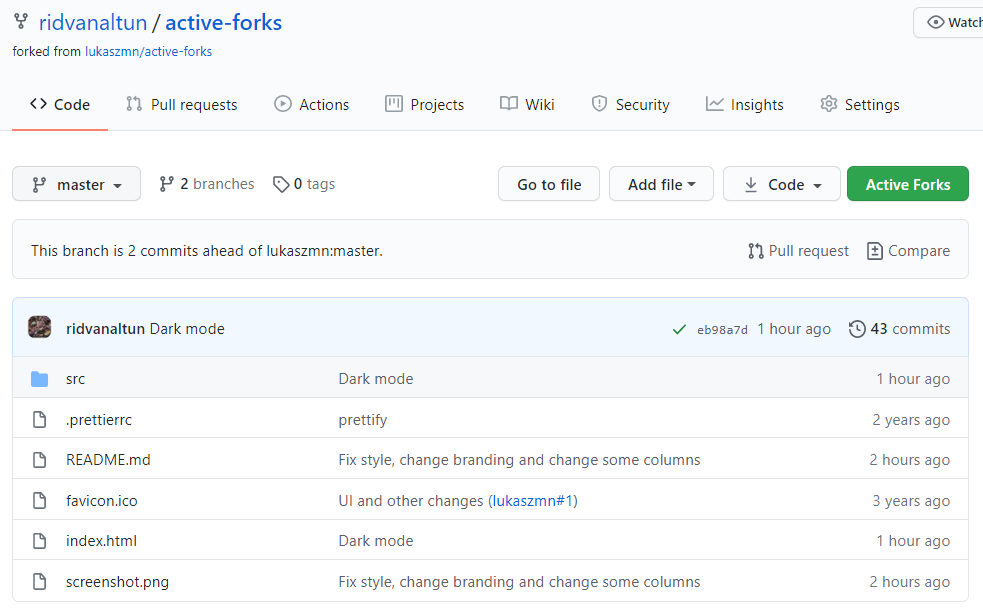

# Active Forks Browser extension

> This is the browser extension for [Active Forks](https://github.com/ridvanaltun/active-forks).

It supports Chrome, Firefox and Edge.

[](https://addons.mozilla.org/en/firefox/addon/active-forks/)
[](https://chrome.google.com/webstore/detail/active-forks/kicchcnkocbmnmlpmjoojinofkagcjpi)

## Showcase



## Build

### Chrome & Firefox

```
yarn install && yarn build && yarn package
```

### Safari

#### ⚠️ A machine running macOS and [Xcode 12+](https://developer.apple.com/xcode/) installed is required!

First, run the following to install dependencies and build the web extension:

```
yarn install && yarn build && yarn package
```

Then run the `build:safari` command to build the Safari extension around the web extension:

```
yarn build:safari
```

Hit `enter` when presented with this screen.

`Xcode` will open the `ActiveForks.xcodeproj` automatically if it's installed.

## Test

[Build](#build) the extension and
* unzip `active-forks.xpi` and load it as [“unpackaged extension” (Chrome)](https://developer.chrome.com/extensions/getstarted) or
* load `active-forks.xpi` as [“temporary add-on” (Firefox)](https://blog.mozilla.org/addons/2015/12/23/loading-temporary-add-ons/) or
* open `ActiveForks/ActiveForks.xcodeproj` and run the project with `cmd` + `r`. ⚠️ _Safari must have [**Allow Unsigned Extensions**](https://developer.apple.com/documentation/safariservices/safari_app_extensions/building_a_safari_app_extension) enabled._

The extension is active until the next restart of your browser.

# Disclaimer

This project and even documentation is clone of [Gitpod Browser](https://github.com/gitpod-io/browser-extension) extension. All code rebranded to use web extension markets properly.